# AssetFlow ERP – Enterprise Asset & Resource Management System

[](https://assetflow-erp.netlify.app)
[](https://github.com/nimmisahu222716-lab/Assetflow)
[](https://react.dev/)
[](https://nodejs.org/)
[](https://expressjs.com/)
[](https://www.mongodb.com/)
[](LICENSE)

**AssetFlow ERP** is a full-stack **Enterprise Asset & Resource Management System** built using the MERN stack. It helps organizations manage assets, employees, departments, shared resources, maintenance, transfers, audits, notifications, and operational analytics through secure role-based workflows.

##  Project Links

 **Live Demo:** https://assetflow-erp.netlify.app

 **GitHub Repository:** https://github.com/nimmisahu222716-lab/Assetflow

---

##  Key Features

-  **Authentication & Role-Based Access Control** – Secure JWT authentication with Admin, Asset Manager, Department Head, and Employee roles.
-  **Asset Management** – Register, search, filter, allocate, transfer, return, and track assets throughout their lifecycle.
-  **Double-Allocation Prevention** – Prevents an already allocated asset from being assigned to another user and provides a transfer request workflow.
-  **Resource Booking** – Book shared resources using time slots with automatic overlap validation.
-  **Maintenance Management** – Raise, approve, assign, track, and resolve maintenance requests with automatic asset status updates.
-  **Asset Audits** – Create audit cycles, assign auditors, verify assets, and generate discrepancy reports.
-  **Reports & Analytics** – Monitor asset utilization, maintenance activity, department allocations, and resource usage.
-  **Notifications & Activity Logs** – Track overdue returns, bookings, transfers, maintenance events, audit discrepancies, and user actions.
-  **Responsive UI** – Optimized for desktop, tablet, and mobile devices.

---

##  User Roles

| Role | Main Capabilities |
| :--- | :--- |
| **Admin** | Organization setup, employee & role management, audit cycles, analytics |
| **Asset Manager** | Asset registration, allocation, transfers, maintenance |
| **Department Head** | Department assets, approvals, resource booking |
| **Employee** | Assigned assets, resource booking, maintenance & transfer requests |

---

##  Demo Accounts

Use these accounts to explore different role-based workflows in the live application.

| Role | Email | Password |
| :--- | :--- | :--- |
| **Admin** | `admin@assetflow.com` | `Admin123!` |
| **Asset Manager** | `manager@assetflow.com` | `Manager123!` |
| **Department Head** | `depthead@assetflow.com` | `Head123!` |
| **Employee** | `employee@assetflow.com` | `Emp123!` |

> **Tip:** Try logging in with different accounts to explore role-specific dashboards, permissions, and workflows.

---

##  Application Showcase

###  Home

<p align="center">
  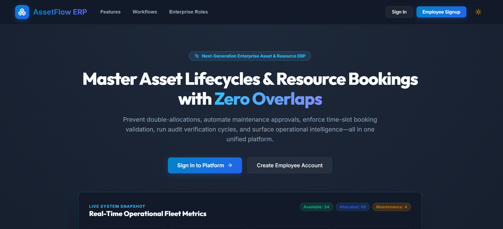
</p>

###  Login

<p align="center">
  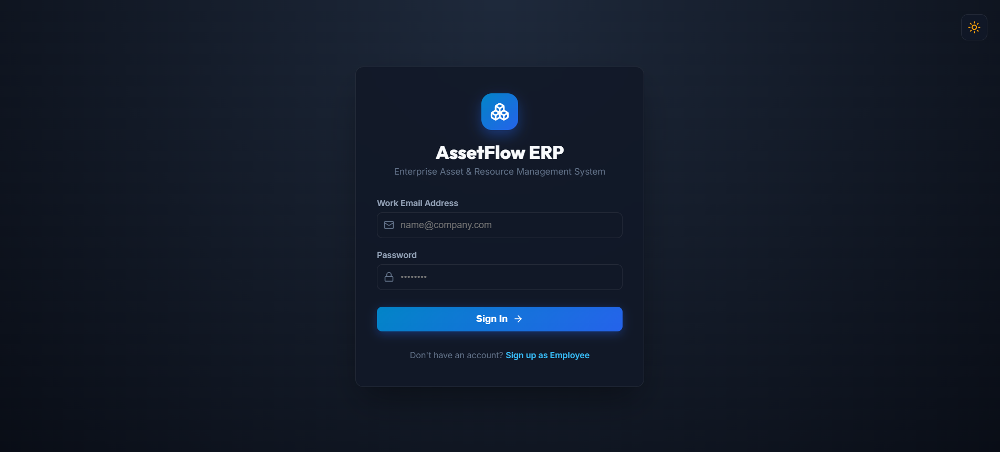
</p>

###  Signup

<p align="center">
  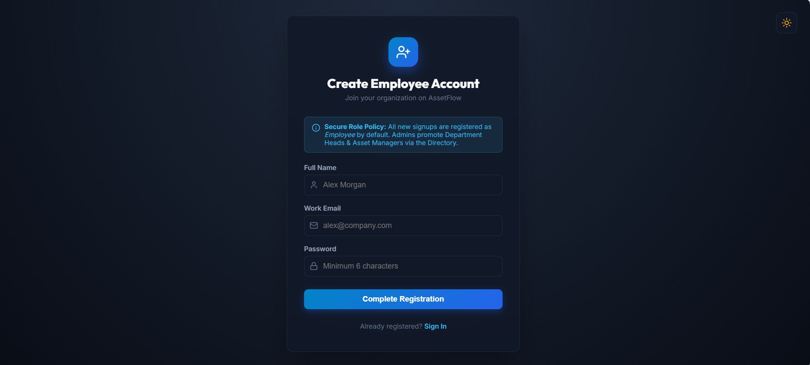
</p>

###  Dashboard

<p align="center">
  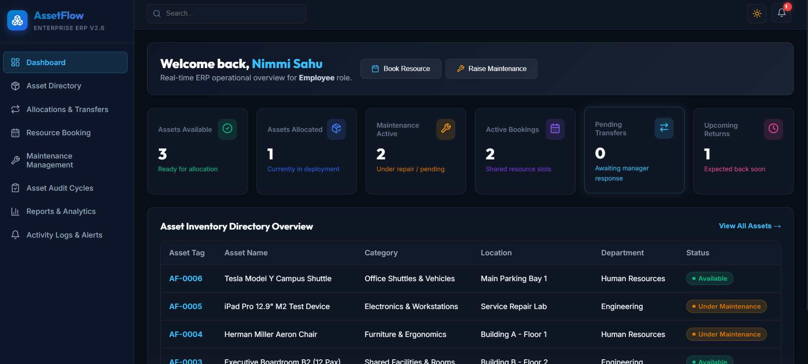
</p>

###  Asset Directory

<p align="center">
  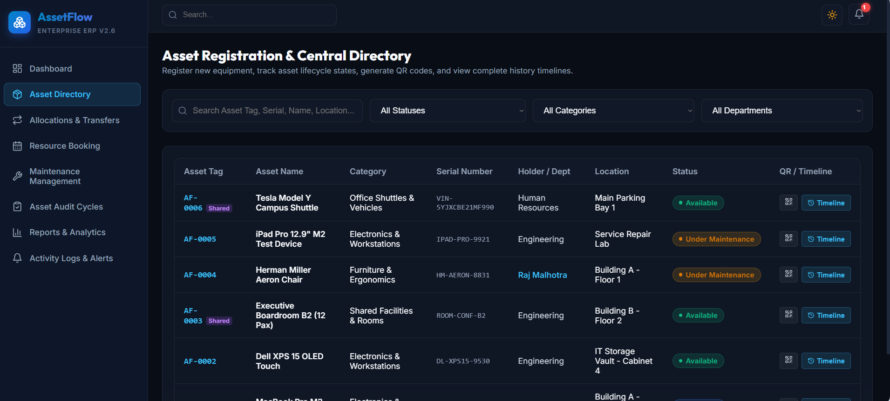
</p>

###  Allocations & Transfers

<p align="center">
  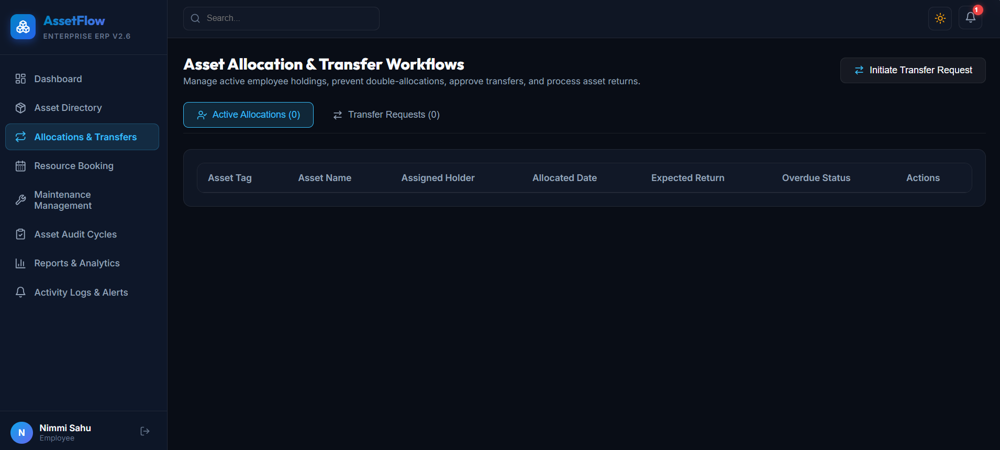
</p>

###  Resource Booking

<p align="center">
  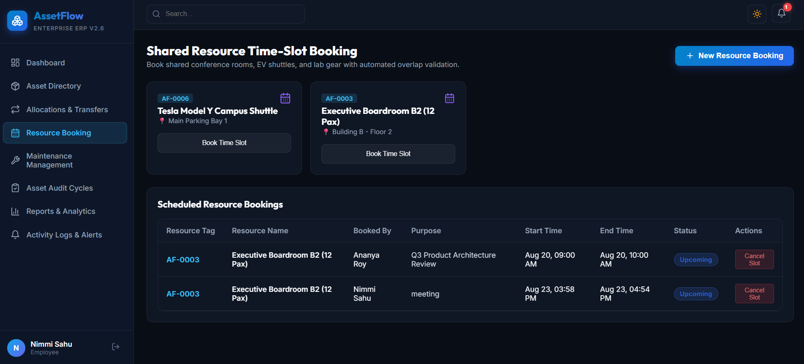
</p>

###  Maintenance Management

<p align="center">
  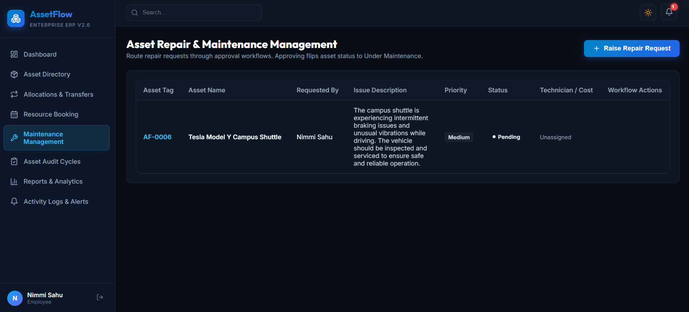
</p>

###  Asset Audit

<p align="center">
  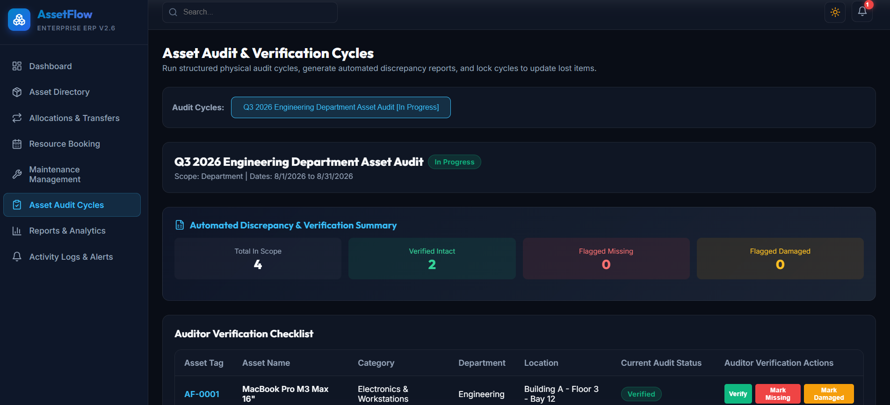
</p>

###  Reports & Analytics

<p align="center">
  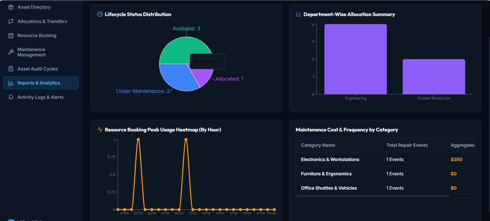
</p>

###  Activity Logs & Alerts

<p align="center">
  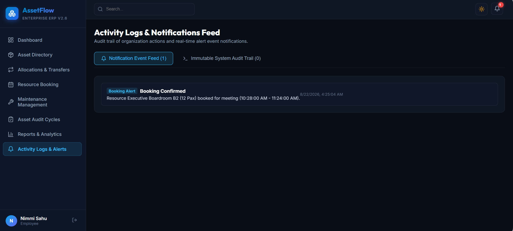
</p>

---

##  Core Business Logic

### Asset Allocation

Prevents double allocation of an asset that is already allocated, reserved, or under maintenance.

```text
Asset Allocation
       ↓
Conflict Check
       ↓
Allocated / Transfer Request

### Resource Booking

Prevents overlapping bookings for the same shared resource using time-slot validation.

```text
Booking Request
       ↓
Time-Slot Validation
       ↓
Confirmed / Rejected
```

### Maintenance Workflow

Asset status automatically changes throughout the maintenance process.

```text
Pending
   ↓
Approved
   ↓
Under Maintenance
   ↓
Resolved
   ↓
Available
```

### Asset Lifecycle

```text
Available ↔ Allocated
      ↓
   Reserved
      ↓
Under Maintenance
      ↓
   Available

Other states:
Lost | Retired | Disposed
```

---

##  Architecture

```text
React + Vite
     ↓
REST APIs
     ↓
Node.js + Express
     ↓
MongoDB + Mongoose
```

---

##  Tech Stack

**Frontend:** React.js, Vite, JavaScript, HTML5, CSS3  
**Backend:** Node.js, Express.js, REST APIs  
**Database:** MongoDB, Mongoose  
**Authentication:** JWT, bcrypt  
**Tools:** Git, GitHub, npm  
**Deployment:** Netlify + Render

---

##  Getting Started

### Prerequisites

- Node.js 18+
- npm 9+
- MongoDB / MongoDB Atlas

### Installation

```bash
git clone https://github.com/nimmisahu222716-lab/Assetflow.git
cd Assetflow

npm install
npm run install-all
```

### Start the Backend

```bash
cd server
npm start
```

### Start the Frontend

Open a new terminal:

```bash
cd client
npm run dev
```

Create the required environment variables in `.env` before running the application.

---

##  About the Author

**Nimmi Sahu**  
MCA Student | Full-Stack Developer

I am an MCA student at **Jawaharlal Nehru University (JNU), New Delhi**, with a strong interest in full-stack web development and software engineering. I enjoy building practical applications using the **MERN stack** and solving real-world problems through technology.

###  Connect With Me

-  **LinkedIn:** [Nimmi Sahu](https://www.linkedin.com/in/nimmi-sahu-511b77324)
-  **GitHub:** [nimmisahu222716-lab](https://github.com/nimmisahu222716-lab)
-  **AssetFlow Live Demo:** [assetflow-erp.netlify.app](https://assetflow-erp.netlify.app)

---
