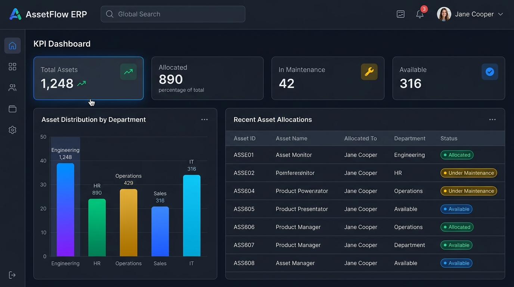
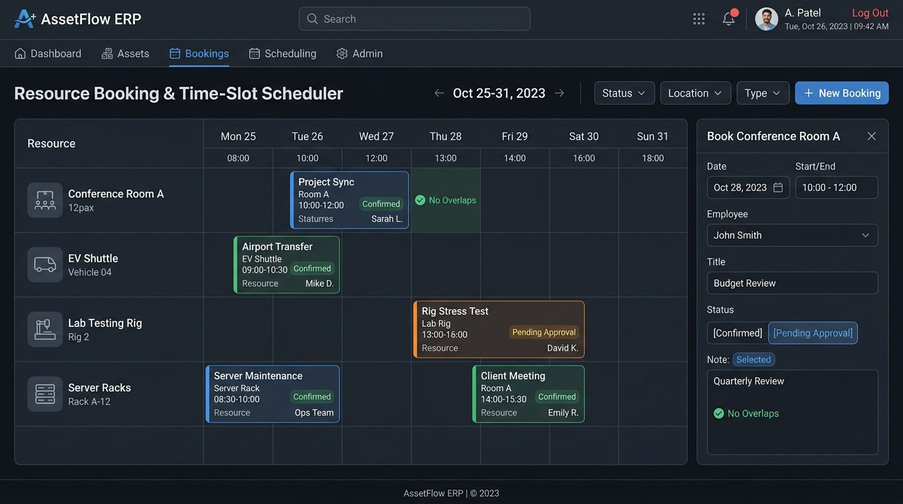

# AssetFlow ERP - Enterprise Asset & Resource Management System

[](https://nodejs.org/)
[](https://reactjs.org/)
[](https://expressjs.com/)
[](https://www.mongodb.com/)
[](LICENSE)

**AssetFlow ERP** is a full-stack Enterprise Asset & Shared Resource Management System engineered with the **MERN Stack** (MongoDB, Express, React, Node.js). Designed for high-scale organizations, AssetFlow automates the lifecycle of physical equipment, shared conference spaces, lab machinery, repair workflows, and physical audit verification cycles while enforcing strict concurrency constraints.

<p align="center">
  
</p>

---

## Application Interface & UI Showcase

| Enterprise Executive Dashboard | Resource Booking & Time-Slot Scheduler |
| :---: | :---: |
|  |  |

---

## Core Business Features

### 1. Concurrency & Double-Allocation Prevention Engine
- Enforces an automated state lock before assigning equipment.
- If an asset is already assigned (`Allocated`, `Reserved`, or `Under Maintenance`), double-allocation is blocked immediately with full context regarding the current holder.
- Offers an automated **Transfer Request** workflow directly to the current holder or Asset Manager.

### 2. Time-Slot Resource Booking Engine
- Book shared conference rooms, EV shuttles, and lab test devices by specific time slots.
- **Overlap Conflict Engine**: Uses interval logic `(newStart < existingEnd AND newEnd > existingStart)` to prevent scheduling collisions.

### 3. Approval Repair & Maintenance Workflows
- Employees or asset holders can raise repair requests with priority levels and issue descriptions.
- **Automated State Flip**: Approving a repair request automatically flips the asset status to `Under Maintenance`. Upon repair completion, the asset status automatically reverts to `Available`.

### 4. Physical Audit & Verification Cycles
- Run scheduled physical inventory audit cycles scoped by Department or Location.
- Auditors flag items as **Verified**, **Missing**, or **Damaged**, generating real-time discrepancy reports.
- **Lock Cycle Operation**: Locking an audit cycle finalizes the report and automatically transitions missing items to `Lost` status across the ERP directory.

### 5. Role-Based Access Control (RBAC)
- **Super Admin**: Department & Category master setup, role promotions, system logs.
- **Asset Manager**: Asset registration, allocation/return processing, transfer approval, maintenance resolution.
- **Department Head**: Department allocation overview, intra-department transfer approvals, shared resource bookings.
- **Employee**: View personal items, book shared resources, request asset repairs and transfers.

### Responsive Touch-Optimized UI
- Fully responsive across all display breakpoints (Mobile 320px–480px, Tablet 768px, Laptop/Desktop 1024px+).
- Features off-canvas slide-over navigation drawers, touch-scrollable data tables, and dynamic form grids.

---

## Getting Started

### Prerequisites
- **Node.js**: `v18.0.0` or higher
- **npm**: `v9.0.0` or higher

### Installation

1. **Clone the Repository**:
   ```bash
   git clone https://github.com/nimmisahu222716-lab/Assetflow.git
   cd Assetflow
   ```

2. **Install Root, Server, and Client Dependencies**:
   ```bash
   npm install
   npm run install-all
   ```

3. **Start Development Application**:
   ```bash
   npm run dev
   ```
   - **Frontend App**: `http://localhost:3000`
   - **Backend Express API**: `http://localhost:5000/api`

---

## Pre-Seeded Demo Accounts

The database comes pre-seeded with sample enterprise data and ready-to-use user accounts:

| Role | Email | Password | Access Rights |
| :--- | :--- | :--- | :--- |
| **System Admin** | `admin@assetflow.com` | `Admin123!` | Full System Master Access |
| **Asset Manager** | `manager@assetflow.com` | `Manager123!` | Inventory, Allocations & Maintenance |
| **Department Head** | `depthead@assetflow.com` | `Head123!` | Department Oversight & Resource Booking |
| **Employee** | `employee@assetflow.com` | `Emp123!` | Personal Dashboard & Repair Requests |

---

## Integration Test Suite

Verify all 7 core backend business rules by running the integration test runner:

```bash
cd server
node test-api.js
```

### Test Output Verification:
```text
=== RUNNING ASSETFLOW ERP BACKEND INTEGRATION TESTS ===

1. Admin Login: PASS Admin
2. Asset Directory Listing: PASS Total Assets: 6
3. Double-Allocation Prevention Engine: PASS
4. Time-Slot Overlap Validation Engine: PASS
5. Contiguous Non-Overlapping Booking: PASS
6. Maintenance Approval Asset Status Transition (Under Maintenance): PASS
7. Maintenance Resolution Asset Status Transition (Available): PASS

=== ALL ENTERPRISE BACKEND BUSINESS RULES VERIFIED SUCCESSFULLY ===
```

---

## Security & Hardening Checklist

- **Secrets Isolation**: Environment variables managed via `.env` (excluded from git tracking).
- **Authentication**: JWT tokens with 30-day expiration and bcrypt password hashing.
- **DB Protection**: Mongoose ODM with MongoDB Memory Server fallback for isolated testing.
- **Audit Logging**: Comprehensive transactional audit logging for all creation, transfer, maintenance, and role actions.

---

## License

This project is licensed under the MIT License - see the [LICENSE](LICENSE) file for details.
